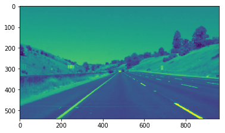
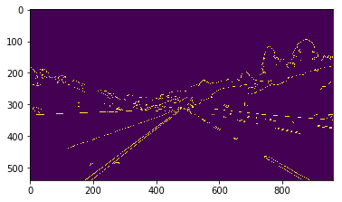
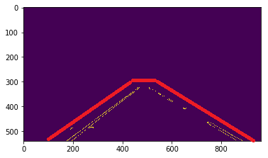

# **Finding Lane Lines on the Road** 

## Introduction

### In this project, I adopted the simple lane detection algorithm taught in the Udacity Nano-Degree programm and applied it to first detect lanes on a static image, then take a short video as input and process the video (as continuous image frames)to detect the lanes in the recorded video. 

---

**Finding Lane Lines on the Road**

The goals / steps of this project are the following:
* Make a pipeline that finds lane lines on the road
* Reflect on your work in a written report

[//]: # (Image References)

[image1]: ./examples/grayscale.jpg "Grayscale"

---

### Reflection

### 1. Pipeline to detect the lanes on a static image.

My pipeline consisted of 5 steps: 
First, I converted the images to grayscale;

Second,apply a Gaussian blur to reduce the image noise and details.

Third, apply Canny edge detection.

Fourth, crop the image to a region of interest. For this special case, as the camera is fixed on the car, so the ROI will always be the front area contains the lane information. In this project, a trapezoid region is created.

Fifth, define the Hough transformation parameters and apply Hough transforms to detect the lines in the image. The detected lines will be some line segments. 

In order to draw a single line on the left and right lanes, I modified the draw_lines() function by separating those line segments into Left and Right groups, using the polyfit function to find the single line ,and then get the intersections of it and the ROI. In the end just draw the lines between Left Start and End points, and Right Start and End points.

### 2. Potential shortcomings with the current pipeline

One potential shortcoming would that it will not be able to detect the lanes when the car is trying to switch lanes because the ROI is fixed.

Another shortcoming could be that when the car is driving around a curve, the draw_lines function will not work because it is only working when lanes are straight.

### 3. Suggest possible improvements to the pipeline

A possible improvement would be to make the ROI dynamic based on different situations. But I could not think of other ways to make it dynamic, plus it may become computation costly.

